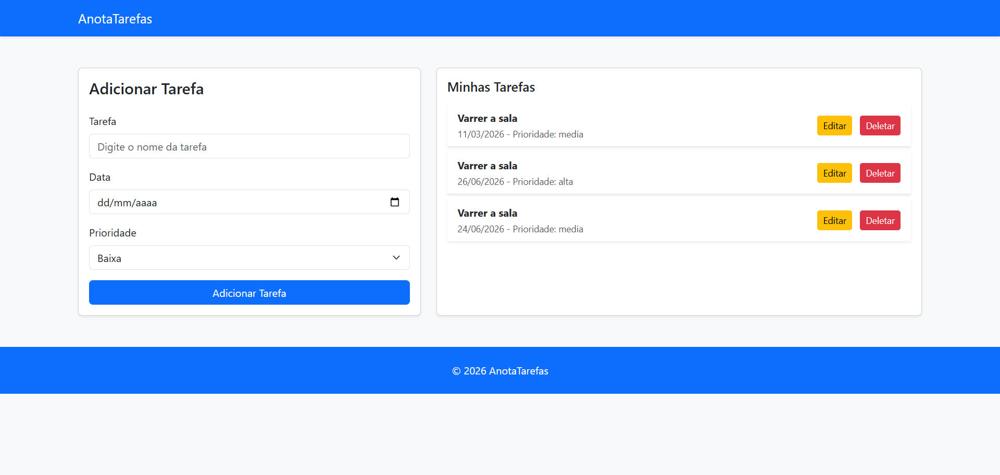

# 📝 AnotaTarefas - PWA Full Stack

Uma aplicação moderna e eficiente para gerenciamento de tarefas, estruturada com separação entre **Frontend** e **Backend**, e configurada como um **Progressive Web App (PWA)**.

---

## 📸 Preview da Aplicação



---

## 🏗️ Estrutura do Projeto

O projeto adota uma arquitetura organizada para facilitar a manutenção e escalabilidade, conforme visualizado na estrutura de pastas:

- **`Frontend/`**: Interface do usuário (HTML, CSS, JS) e configurações de PWA (Manifest e Service Workers).
- **`Backend/`**: Camada de servidor responsável pela persistência de dados e regras de negócio.
- **`.gitignore`**: Configuração de arquivos ignorados pelo controle de versão.
- **`Image.png`**: Captura de tela ou diagrama da aplicação.

---

## 🚀 Funcionalidades

- **Gestão de Tarefas:** Adicione tarefas com **Nome**, **Data** e nível de **Prioridade**.
- **Experiência PWA (Progressive Web App):**
  - **Offline First:** Acesse suas tarefas mesmo sem conexão com a internet.
  - **Instalável:** Adicione o app à tela inicial do celular ou desktop como um aplicativo nativo.
  - **Performance:** Carregamento otimizado através de cache de ativos via Service Worker.
- **Persistência:** Sincronização de dados entre a interface e o servidor.

---

## 🛠️ Tecnologias Utilizadas

### Interface (Frontend)

- **HTML5 & CSS3** — Estrutura semântica e design responsivo (**Mobile First**).
- **JavaScript (ES6+)** — Lógica de manipulação do DOM e integração com o backend.
- **Web App Manifest** — Define como o app aparece ao ser instalado no dispositivo.
- **Service Workers** — Gerencia o cache e o funcionamento offline.

### Servidor (Backend)

- Desenvolvido com foco em **integração de APIs** e **persistência de dados**.

---

## 📋 Como Executar o Projeto

### 1. Iniciar o Backend

Navegue até a pasta do servidor e inicie o serviço:

```bash
cd Backend
npm start
```

### 2. Executar o Frontend

Para que as funcionalidades de PWA sejam ativadas, o frontend precisa ser servido em um ambiente seguro (HTTPS) ou localhost:

```bash
cd Frontend
```
#### Sugestão: Use a extensão "Live Server" do VS Code para rodar o index.html

---

## 📂 Visão Geral do Repositório

```
ANOTATAREFAS/
├── Backend/          # Lógica de servidor e API
├── Frontend/         # Interface, Service Workers e Manifest
├── .gitignore        # Configurações do Git
└── Image.png         # Screenshot do projeto
```

---

## 👤 Autor

Desenvolvido por **Vitor Barbosa Marins**.
